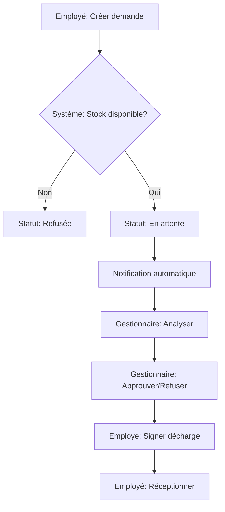
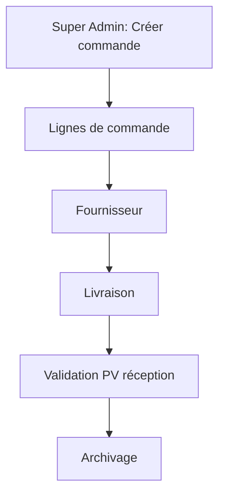
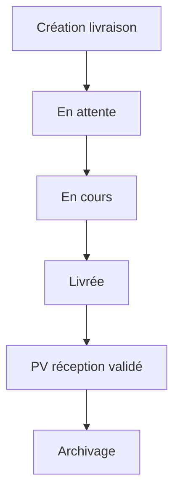

# 📊 Diagramme AS-IS ParcInfo Corrigé - Analyse Réelle

## 🎯 Corrections Apportées

Après analyse approfondie du code source ParcInfo, voici les corrections majeures apportées au diagramme AS-IS :

## ❌ Erreurs Identifiées dans la Version Précédente

### 1. **Statuts de Demande Incorrects**
- ❌ **Faux** : en_attente → en_cours → terminee
- ✅ **Réel** : en_attente → approuvee/refusee

### 2. **Processus d'Approbation Simplifié**
- ❌ **Faux** : Budget suffisant → Demande justifiée → Stock disponible
- ✅ **Réel** : Vérification stock automatique → Notification gestionnaire → Approbation directe

### 3. **Rôles Mal Définis**
- ❌ **Faux** : Gestionnaire générique
- ✅ **Réel** : Gestionnaire Informatique + Gestionnaire Bureau (séparation claire)

### 4. **Processus de Commande Manquant**
- ❌ **Faux** : Processus de commande non représenté
- ✅ **Réel** : Super Admin crée les commandes (informatique/bureau)

## ✅ Processus Réels Identifiés

### 🔄 **Workflow Demande d'Équipement**



### 🛒 **Workflow Commandes**



### 📦 **Workflow Livraisons**



## 📋 **Détails Techniques Réels**

### **Modèles de Données Identifiés**

#### DemandeEquipement
```python
# Statuts réels
STATUT_CHOICES = [
    ('en_attente', 'En attente'),
    ('approuvee', 'Approuvée'),
    ('refusee', 'Refusée'),
]

# Types de demande
TYPE_DEMANDE_CHOICES = [
    ('nouveau', 'Nouveau'),
    ('renouvellement', 'Renouvellement'),
    ('reparation', 'Réparation'),
    ('service', 'Service'),
    ('deplacement', 'Déplacement'),
]

# Catégories
CATEGORIE_CHOICES = [
    ('informatique', 'Informatique'),
    ('bureau', 'Bureau'),
]
```

#### Livraison
```python
# Statuts de livraison
STATUT_LIVRAISON_CHOICES = [
    ('en_attente', 'En attente'),
    ('en_cours', 'En cours'),
    ('livree', 'Livrée'),
    ('retardee', 'Retardée'),
    ('annulee', 'Annulée'),
]
```

### **Système de Notifications**

```python
# Notifications automatiques lors des changements de statut
@receiver(post_save, sender='demande_equipement.DemandeEquipement')
def creer_notification_demande(sender, instance, created, **kwargs):
    if not created and instance._statut_changed:
        # Création automatique de notification
        NotificationDemande.objects.create(...)
```

### **Gestion des Rôles**

```python
# Rôles identifiés dans le code
- Employé
- Gestionnaire Informatique
- Gestionnaire Bureau  
- Super Admin
```

## 🔧 **Processus d'Affectation Réel**

### **Vérification Stock Automatique**
```python
# Dans nouvelle_demande()
if demande.type_article == 'materiel':
    if demande.categorie == 'informatique':
        stock_disponible = MaterielInformatique.objects.filter(
            ligne_commande__designation=demande.designation_info,
            ligne_commande__description=demande.description_info,
            utilisateur__isnull=True,
            statut='nouveau'
        ).count()
        rupture = stock_disponible == 0
```

### **Sélection Matériel par Gestionnaire**
```python
# Dans approuver_demande()
materiels_disponibles = MaterielInformatique.objects.filter(
    ligne_commande__designation=demande.designation_info,
    ligne_commande__description=demande.description_info,
    utilisateur__isnull=True,
    statut='nouveau'
).order_by('code_inventaire')
```

## 📊 **Flux de Données Réels**

### **1. Création Demande**
1. Employé remplit formulaire
2. Système vérifie stock automatiquement
3. Statut défini selon disponibilité
4. Notification envoyée au gestionnaire approprié

### **2. Traitement Gestionnaire**
1. Gestionnaire reçoit notification
2. Analyse de la demande
3. Approuve/Refuse directement
4. Sélectionne matériel si approuvé

### **3. Finalisation**
1. Employé signe décharge digitale
2. Matériel affecté
3. Archive créée automatiquement

## 🎯 **Points Clés de la Correction**

### **Séparation Informatique/Bureau**
- **Gestionnaire Informatique** : Gère uniquement les demandes informatiques
- **Gestionnaire Bureau** : Gère uniquement les demandes bureautiques
- **Permissions** : Chaque gestionnaire n'a accès qu'à sa catégorie

### **Processus Automatisés**
- **Vérification stock** : Automatique lors de la création
- **Notifications** : Automatiques lors des changements de statut
- **Archivage** : Automatique des décharges signées

### **Validation PV Réception**
- Processus séparé pour chaque type de gestionnaire
- Validation manuelle par le gestionnaire approprié
- Traçabilité complète des actions

## 📁 **Fichiers de Référence**

- **`AS-IS_ParcInfo_Corrige.html`** : Diagramme corrigé
- **`apps/demande_equipement/models.py`** : Modèles de données
- **`apps/demande_equipement/views.py`** : Logique métier
- **`apps/livraison/models.py`** : Processus de livraison
- **`apps/users/signals.py`** : Système de notifications

## ✅ **Validation de la Correction**

Le diagramme corrigé reflète maintenant fidèlement :
- ✅ Les statuts réels des demandes
- ✅ La séparation des rôles gestionnaire
- ✅ Les processus automatisés
- ✅ Le workflow de commandes
- ✅ Le système de notifications
- ✅ La validation PV réception

---

**Date de correction** : 2025-01-15  
**Version** : 2.0 (Corrigée)  
**Auteur** : Équipe ParcInfo  
**Statut** : Validé après analyse code ✅
